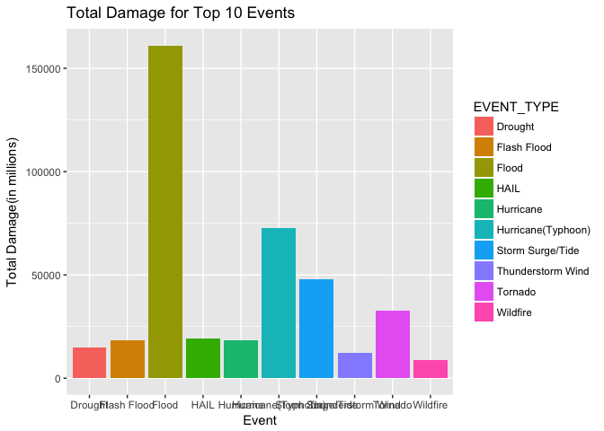
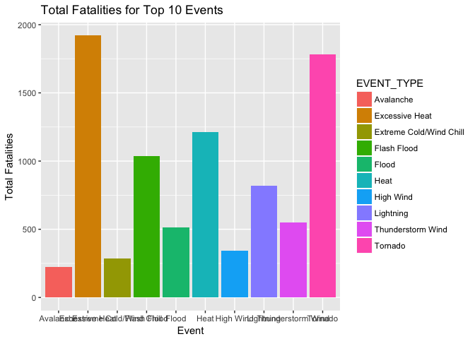
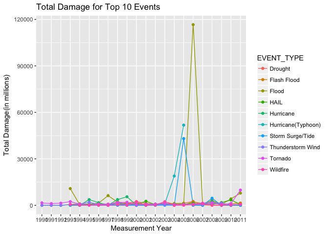

# Economic Consequences & Population Health Hazards of different Event Types
EHarris  
6/10/2017  

## Packages for Course 5 Project 2


## Synopsis
Due to the different types, and serverity, of events experienced throughout a country, 
there is a desire to understand which event types create the greatest economic consequences  
or most hazardous with respect to population health.  

We will be using data provided by the National Oceanic and Atmospheric Administration 
(NOAA) to help answer these questions.  Economic consequences are measured by the amount 
of damage, property and/or crop, that is associated with each event type.  The population 
health hazard is measured by the number of fatalities and/or injuries with an event.  The 
number of fatalities will be the primary metric for determining the population health 
hazard.

The following analysis will show that a FLOOD represents the greatest economic consequence  
across all states, but few fataliies. However, EXCESSIVE HEAT is the greatest harzard to  
population health based on number of fatalities with little economic consequences.

## Data Processing  
A first step to our analysis is reading the data into R from the working directory. The data provided is a zipped csv file.  We unzip and read into R using read.csv file.  The code to read in the file, as well as a couple summaries of the data.

#### Read zipped csv file into R

```r
StormData <- read.csv("repdata-data-StormData.csv.bz2", header = TRUE, sep = ",",
                        quote = "\"", dec = ".")
```

#### EXHIBIT 1: Overview of data file  
###### File Dimensions

```
## [1] 902297     37
```

###### Variable Names & Formats

```
## 'data.frame':	902297 obs. of  37 variables:
##  $ STATE__   : num  1 1 1 1 1 1 1 1 1 1 ...
##  $ BGN_DATE  : Factor w/ 16335 levels "1/1/1966 0:00:00",..: 6523 6523 4242 11116 2224 2224 2260 383 3980 3980 ...
##  $ BGN_TIME  : Factor w/ 3608 levels "00:00:00 AM",..: 272 287 2705 1683 2584 3186 242 1683 3186 3186 ...
##  $ TIME_ZONE : Factor w/ 22 levels "ADT","AKS","AST",..: 7 7 7 7 7 7 7 7 7 7 ...
##  $ COUNTY    : num  97 3 57 89 43 77 9 123 125 57 ...
##  $ COUNTYNAME: Factor w/ 29601 levels "","5NM E OF MACKINAC BRIDGE TO PRESQUE ISLE LT MI",..: 13513 1873 4598 10592 4372 10094 1973 23873 24418 4598 ...
##  $ STATE     : Factor w/ 72 levels "AK","AL","AM",..: 2 2 2 2 2 2 2 2 2 2 ...
##  $ EVTYPE    : Factor w/ 985 levels "   HIGH SURF ADVISORY",..: 834 834 834 834 834 834 834 834 834 834 ...
##  $ BGN_RANGE : num  0 0 0 0 0 0 0 0 0 0 ...
##  $ BGN_AZI   : Factor w/ 35 levels "","  N"," NW",..: 1 1 1 1 1 1 1 1 1 1 ...
##  $ BGN_LOCATI: Factor w/ 54429 levels ""," Christiansburg",..: 1 1 1 1 1 1 1 1 1 1 ...
##  $ END_DATE  : Factor w/ 6663 levels "","1/1/1993 0:00:00",..: 1 1 1 1 1 1 1 1 1 1 ...
##  $ END_TIME  : Factor w/ 3647 levels ""," 0900CST",..: 1 1 1 1 1 1 1 1 1 1 ...
##  $ COUNTY_END: num  0 0 0 0 0 0 0 0 0 0 ...
##  $ COUNTYENDN: logi  NA NA NA NA NA NA ...
##  $ END_RANGE : num  0 0 0 0 0 0 0 0 0 0 ...
##  $ END_AZI   : Factor w/ 24 levels "","E","ENE","ESE",..: 1 1 1 1 1 1 1 1 1 1 ...
##  $ END_LOCATI: Factor w/ 34506 levels ""," CANTON"," TULIA",..: 1 1 1 1 1 1 1 1 1 1 ...
##  $ LENGTH    : num  14 2 0.1 0 0 1.5 1.5 0 3.3 2.3 ...
##  $ WIDTH     : num  100 150 123 100 150 177 33 33 100 100 ...
##  $ F         : int  3 2 2 2 2 2 2 1 3 3 ...
##  $ MAG       : num  0 0 0 0 0 0 0 0 0 0 ...
##  $ FATALITIES: num  0 0 0 0 0 0 0 0 1 0 ...
##  $ INJURIES  : num  15 0 2 2 2 6 1 0 14 0 ...
##  $ PROPDMG   : num  25 2.5 25 2.5 2.5 2.5 2.5 2.5 25 25 ...
##  $ PROPDMGEXP: Factor w/ 19 levels "","-","?","+",..: 17 17 17 17 17 17 17 17 17 17 ...
##  $ CROPDMG   : num  0 0 0 0 0 0 0 0 0 0 ...
##  $ CROPDMGEXP: Factor w/ 9 levels "","?","0","2",..: 1 1 1 1 1 1 1 1 1 1 ...
##  $ WFO       : Factor w/ 542 levels ""," CI","%SD",..: 1 1 1 1 1 1 1 1 1 1 ...
##  $ STATEOFFIC: Factor w/ 250 levels "","ALABAMA, Central",..: 1 1 1 1 1 1 1 1 1 1 ...
##  $ ZONENAMES : Factor w/ 25112 levels "","                                                                                                                               "| __truncated__,..: 1 1 1 1 1 1 1 1 1 1 ...
##  $ LATITUDE  : num  3040 3042 3340 3458 3412 ...
##  $ LONGITUDE : num  8812 8755 8742 8626 8642 ...
##  $ LATITUDE_E: num  3051 0 0 0 0 ...
##  $ LONGITUDE_: num  8806 0 0 0 0 ...
##  $ REMARKS   : Factor w/ 436781 levels "","\t","\t\t",..: 1 1 1 1 1 1 1 1 1 1 ...
##  $ REFNUM    : num  1 2 3 4 5 6 7 8 9 10 ...
```

#### Subset the data
The size of the dataset provided is rather large, but much of the data is not very useful 
to answering the stated questions, or goals.  The following steps are taken to subset the 
dataset to the variables, and dates, that are relevent to the analysis.  This subset 
also facilitates the effort to clean-up the data for further review and analysis.

##### Date / time variables  
There are two areas for clean-up, or defining subset, of the original file with respect 
to dates and/or times provided.  Key to these decisions to include or remove is whether 
the information supports the analysis.  A statement about time of an event provided by  
National Weather Service:

"In general, the time of an event, as it appears in the header-strip, is the time when 
the event reached locally, regionally, or nationally established advisory or warning 
criteria (exceptions defined in Section 2.3.1). The event time could be the single time 
that a peak wind gust of 65 knots (75 mph) occurred, or it could be beginning and ending 
times of a 10-minute shower of large, damaging hailstones. If the time of the event in 
the header-strip is a broad guesstimate,then it should be indicated as such in the event 
narrative."

The first step is evaluating the quality of the data.  For each EVTYPE and REFNUM, a 
unique reporting instance provided in data file, a BGN_DATE, BGN_TIME, END_DATE, and 
END_TIME.  The BGN_DATE, BGN_TIME, along with a TIME_ZONE are consistently populated.  
This is not true for END_DATE and END_TIME.  As there is not a good way to populate or 
impute appropriate values, these variables provide little value towards analyziing the 
event types in the dataset.  These veariables, therefore, will be removed from subset.


For END_DATE, there are 2.43411\times 10^{5} missing dates, or 27 percent of total.

The other consideration for dates / times is relevance of the data.  The data includes 
data between 1950 - 2011.  Because of shifting populations over time the data for events 
prior to 1990 are not as relevant to evaluating the economic consequences or hazards to 
population health represented by an event. Data for dates prior to 1990 are removed from 
the subset.

##### Format dates to exclude experience prior to 1990  

```r
StormData$BGN_DATE <- as.Date(StormData$BGN_DATE, "%m/%d/%Y")
StormData$BGN_YEAR <- format(StormData$BGN_DATE, "%Y")
StormData$hour <- as.numeric(substr(StormData$BGN_TIME, 1, 2))
StormData$minute <- substr(StormData$BGN_TIME, 3, 4)
StormData$ampm <- ifelse(StormData$hour > 12, "PM", "AM")
StormData$hour <- ifelse(StormData$hour > 12, StormData$hour - 12, 
                              ifelse(StormData$hour < 1, 12, StormData$hour))
StormData$hour <- substr(paste("00", StormData$hour, sep = ""), 
                         min(length(StormData$hour)+1,3),min(length(StormData$hour)+2, 4))

StormData$BGN_TIME <- paste(StormData$hour, ":", StormData$minute, " ", 
                                                      StormData$ampm, sep = "")
```
NOTE:  Although BGN_TIME & TIME_ZONE are not critical to analysis, they will be included 
in the subset of the data.

##### Defining the location or area for an event
There are four variables -- STATE, COUNTYNAME, LATITUDE, & LONGITUDE --  that are 
well-populated and could be used to support analysis by location.  Only these 4  variables 
are included in final, tidy,  dataset to be used for analysis.  Other location related 
variables are sparsely populated.

NOTE:  Location is not used in the final analysis for determining the event type with the 
greatest economic consequences or hazard to population health.  Results will evaluated 
across all markets combined.

#### Creating the subset
We will not be keeping many of the poorly populated variables provided in the zip file 
we received.  They do not lend themselves to a further understanding of the questions 
for analysis. 

The final processing of the dataset is to limit the final dataset to data to BGN_Dates 
on or after "1990-01-01".  Although data captures events as early as 1950, there have 
been significant shifts in population density and development that may distort results 
by including the earlier years. 


```r
subStormData <- select(StormData, REFNUM, BGN_YEAR, BGN_DATE, BGN_TIME, TIME_ZONE,
                       STATE, COUNTYNAME, LATITUDE, LONGITUDE, EVTYPE, F, MAG,
                       FATALITIES, INJURIES, PROPDMG, PROPDMGEXP, CROPDMG, CROPDMGEXP)
subStormData <- subset(subStormData, BGN_YEAR > "1989")
subStormData <- subStormData[order(subStormData$STATE, subStormData$COUNTYNAME,
                                    subStormData$EVTYPE, subStormData$BGN_DATE),]
```

#### EXHIBIT 2: Overview of data subset  
##### Data Subset Dimensions  

```
## [1] 751740     18
```

##### Variable Names & Formats in Data Subset  

```
## 'data.frame':	751740 obs. of  18 variables:
##  $ REFNUM    : num  188879 188881 188882 188774 188777 ...
##  $ BGN_YEAR  : chr  "1993" "1993" "1993" "1994" ...
##  $ BGN_DATE  : Date, format: "1993-02-01" "1993-02-05" ...
##  $ BGN_TIME  : chr  "12:00 AM" "12:00 AM" "12:00 AM" "2:00 PM" ...
##  $ TIME_ZONE : Factor w/ 22 levels "ADT","AKS","AST",..: 3 3 3 3 3 3 3 3 3 3 ...
##  $ STATE     : Factor w/ 72 levels "AK","AL","AM",..: 1 1 1 1 1 1 1 1 1 1 ...
##  $ COUNTYNAME: Factor w/ 29601 levels "","5NM E OF MACKINAC BRIDGE TO PRESQUE ISLE LT MI",..: 21 21 21 21 21 21 21 21 21 21 ...
##  $ LATITUDE  : num  0 0 0 0 0 0 0 0 0 0 ...
##  $ LONGITUDE : num  0 0 0 0 0 0 0 0 0 0 ...
##  $ EVTYPE    : Factor w/ 985 levels "   HIGH SURF ADVISORY",..: 30 30 30 30 30 30 30 30 30 30 ...
##  $ F         : int  NA NA NA NA NA NA NA NA NA NA ...
##  $ MAG       : num  0 0 0 0 0 0 30 46 0 0 ...
##  $ FATALITIES: num  0 0 0 0 0 0 0 0 1 0 ...
##  $ INJURIES  : num  0 0 0 0 0 0 0 0 0 0 ...
##  $ PROPDMG   : num  0 0 0 0 0 0 0 0 0 0 ...
##  $ PROPDMGEXP: Factor w/ 19 levels "","-","?","+",..: 1 1 1 1 1 1 1 1 1 1 ...
##  $ CROPDMG   : num  0 0 0 0 0 0 0 0 0 0 ...
##  $ CROPDMGEXP: Factor w/ 9 levels "","?","0","2",..: 1 1 1 1 1 1 1 1 1 1 ...
```


#### Standardize Dollar Amounts  
To facilitate analysis, it is necessary to modify the orginal data in some cases.  As an  
example, the dollar amounts for property damage are expressed in different denomiations  
(e.g. thousand vs. millions of dollars).  It is important to define a consistent measure  
so that dollars can be combined, or summed, for different levels of aggregation, as  
appropriate.

```r
subStormData$PROPDMG <- subStormData$PROPDMG * 
                        ifelse(subStormData$PROPDMGEXP %in% c("h","H"), 100,
                        ifelse(subStormData$PROPDMGEXP %in% c("k", "K"), 1000,
                        ifelse(subStormData$PROPDMGEXP %in% c("m", "M"), 1000000,
                        ifelse(subStormData$PROPDMGEXP %in% c("b", "B"), 1000000000, 1))))
subStormData$CROPDMG <- subStormData$CROPDMG * 
                        ifelse(subStormData$CROPDMGEXP %in% c("h","H"), 100,
                        ifelse(subStormData$CROPDMGEXP %in% c("k", "K"), 1000,
                        ifelse(subStormData$CROPDMGEXP %in% c("m", "M"), 1000000,
                        ifelse(subStormData$CROPDMGEXP %in% c("b", "B"), 1000000000, 1))))
subStormData$TTLDMG <- subStormData$PROPDMG + subStormData$CROPDMG
subStormData <- select(subStormData, -c(PROPDMGEXP, CROPDMGEXP))
```

#### Standardizing Event Type

In the dataset provided, there are 985 unique EVTYPE, defining the types of events 
that have occurred.  According to the National Weather Service Instruction 10-165 
released on August 17, 2007, events should fit into one of 48 event types or categories  
that have been defined.

The following steps reflect an effort to more consistently define the actual list of 
event types in the data with recommended list.  This represents a 'best effort' to 
improve the quality of the data.  Ideally, a mapping would be provided by the owner of 
the dataset to ensure a more accurrate cross-walk.  

```r
subStormData$EVENT_TYPE <- ifelse(grepl("TORNADO", subStormData$EVTYPE, 
                                          ignore.case = TRUE), "Tornado",
                              ifelse(grepl("TYPHOON", subStormData$EVTYPE,
                                          ignore.case = TRUE), "Hurricane(Typhoon)",
                              ifelse(grepl("HURRICAN", subStormData$EVTYPE,
                                          ignore.case = TRUE), "Hurricane",
                              ifelse(grepl("TSUNAMI", subStormData$EVTYPE,
                                          ignore.case = TRUE), "Tsunami",
                              ifelse(grepl("FUNNEL", subStormData$EVTYPE,
                                          ignore.case = TRUE), "Funnel Cloud",
                              ifelse(grepl("AVALANCHE", subStormData$EVTYPE,
                                          ignore.case = TRUE), "Avalanche",
                              ifelse(grepl("BLIZZARD", subStormData$EVTYPE,
                                          ignore.case = TRUE), "Blizzard",
                              ifelse(grepl("MARINE HAIL", subStormData$EVTYPE,
                                          ignore.case = TRUE), "Marine Hail",
                              ifelse(grepl("MARINE HIGH WIND", subStormData$EVTYPE,
                                          ignore.case = TRUE), "Marine High Wind",
                              ifelse(grepl("MARINE STRONG WIND", subStormData$EVTYPE,
                                          ignore.case = TRUE), "Marine Strong Wind",
                              ifelse(grepl("MARUNE THUNDERSTORM", subStormData$EVTYPE,
                                          ignore.case = TRUE), "Marine Thunderstorm Wind",
                              ifelse(grepl("THUNDERSTORM", subStormData$EVTYPE,
                                          ignore.case = TRUE), "Thunderstorm Wind",
                              ifelse(grepl("TSTM", subStormData$EVTYPE,
                                          ignore.case = TRUE), "Thunderstorm Wind",
                              ifelse(grepl("HAIL", subStormData$EVTYPE,
                                          ignore.case = TRUE), "HAIL",
                              ifelse(grepl("EXTREME COLD", subStormData$EVTYPE,
                                          ignore.case = TRUE), "Extreme Cold/Wind Chill",
                              ifelse(grepl("EXTREME WIND CHILL", subStormData$EVTYPE,
                                          ignore.case = TRUE), "Extreme Cold/Wind Chill",
                              ifelse(grepl("COLD", subStormData$EVTYPE,
                                          ignore.case = TRUE), "Cold/Wind Chill",
                              ifelse(grepl("WIND CHILL", subStormData$EVTYPE,
                                          ignore.case = TRUE), "Cold/Wind Chill",
                              ifelse(grepl("FOG", subStormData$EVTYPE,
                                          ignore.case = TRUE), 
                                          ifelse(grepl("FREEZ", subStormData$EVTYPE,
                                                ignore.case = TRUE), "Freezing Fog",
                                                "Dense Fog"),
                              ifelse(grepl("FLOOD", subStormData$EVTYPE,
                                          ignore.case = TRUE),
                                          ifelse(grepl("LAKE", subStormData$EVTYPE,
                                                ignore.case = TRUE), "Lakeshore Flood",
                                          ifelse(grepl("FLASH", subStormData$EVTYPE,
                                                ignore.case = TRUE), "Flash Flood",
                                          ifelse(grepl("COASTAL", subStormData$EVTYPE,
                                                ignore.case = TRUE), "Coastal Flood",
                                          ifelse(grepl("SHORE", subStormData$EVTYPE,
                                                ignore.case = TRUE), "Coastal Flood",
                                                "Flood")))),
                              ifelse(grepl("FIRE", subStormData$EVTYPE,
                                          ignore.case = TRUE), "Wildfire",
                              ifelse(grepl("DROUGHT", subStormData$EVTYPE,
                                          ignore.case = TRUE), "Drought",
                              ifelse(grepl("DRY", subStormData$EVTYPE,
                                          ignore.case = TRUE), "Drought",
                              ifelse(grepl("HEAT", subStormData$EVTYPE,
                                          ignore.case = TRUE),
                                          ifelse(grepl("EXCESSIVE", subStormData$EVTYPE,
                                                ignore.case = TRUE), "Excessive Heat",
                                                "Heat"),
                              ifelse(grepl("LIGHTNING", subStormData$EVTYPE,
                                          ignore.case = TRUE), "Lightning",
                              ifelse(grepl("SNOW", subStormData$EVTYPE,
                                          ignore.case = TRUE),
                                          ifelse(grepl("LAKE", subStormData$EVTYPE,
                                                ignore.case = TRUE), "Lake-effect Snow",
                                          ifelse(grepl("HEAVY", subStormData$EVTYPE,
                                                ignore.case = TRUE), "Heavy Snow",
                                          ifelse(grepl("SLEET", subStormData$EVTYPE,
                                                ignore.case = TRUE), "Winter Weather",
                                          ifelse(grepl("ICE", subStormData$EVTYPE,
                                                ignore.case = TRUE), "Winter Weather",
                                          ifelse(grepl("RAIN", subStormData$EVTYPE,
                                                ignore.case = TRUE), "Winter Weather",
                                                "Winter Storm"))))),
                              ifelse(grepl("HOT", subStormData$EVTYPE,
                                          ignore.case = TRUE), "HEAT",
                              ifelse(grepl("DUST", subStormData$EVTYPE,
                                          ignore.case = TRUE),
                                          ifelse(grepl("DEVIL", subStormData$EVTYPE,
                                                ignore.case = TRUE), "Dust Devil",
                                                      "Dust Storm"),
                              ifelse(grepl("FROST", subStormData$EVTYPE,
                                          ignore.case = TRUE), "Frost / Freeze",
                              ifelse(grepl("FREEZE", subStormData$EVTYPE,
                                          ignore.case = TRUE), "Frost / Freeze",
                              ifelse(grepl("ICE ROADS", subStormData$EVTYPE,
                                          ignore.case = TRUE), "Frost / Freeze",
                              ifelse(grepl("SLEET", subStormData$EVTYPE,
                                          ignore.case = TRUE), "Sleet",
                              ifelse(grepl("VOLCANIC", subStormData$EVTYPE,
                                          ignore.case = TRUE), "Volcanic Ash",
                              ifelse(grepl("RAIN", subStormData$EVTYPE,
                                          ignore.case = TRUE), "Heavy Rain",
                              ifelse(grepl("WET", subStormData$EVTYPE,
                                          ignore.case = TRUE), "Heavy Rain",
                              ifelse(grepl("MICROBURST", subStormData$EVTYPE,
                                          ignore.case = TRUE), "Strong Wind",
                              ifelse(grepl("Wind", subStormData$EVTYPE,
                                          ignore.case = TRUE), 
                                          ifelse(grepl("HIGH", subStormData$EVTYPE,
                                                ignore.case = TRUE), "High Wind",
                                          ifelse(grepl("STRONG", subStormData$EVTYPE,
                                                ignore.case = TRUE), "Strong Wind",
                                                "High Wind")),
                              ifelse(grepl("PRECIPITATION", subStormData$EVTYPE,
                                          ignore.case = TRUE), "Heavy Rain",
                              ifelse(grepl("FLD", subStormData$EVTYPE,
                                          ignore.case = TRUE), "Flood",
                              ifelse(grepl("ASTRONOMICAL LOW TIDE", subStormData$EVTYPE,
                                          ignore.case = TRUE), "Astronomical Low Tide",
                              ifelse(grepl("ASTRONOMICAL HIGH TIDE", subStormData$EVTYPE,
                                          ignore.case = TRUE), "Coastal Flood",
                              ifelse(grepl("SURGE", subStormData$EVTYPE,
                                          ignore.case = TRUE), "Storm Surge/Tide",
                              ifelse(grepl("TIDE", subStormData$EVTYPE,
                                          ignore.case = TRUE), "Storm Surge/Tide",
                              ifelse(grepl("EROSION", subStormData$EVTYPE,
                                          ignore.case = TRUE), "Storm Surge/Tide",
                              ifelse(grepl("FREEZING DRIZZLE", subStormData$EVTYPE,
                                          ignore.case = TRUE), "Sleet",
                              ifelse(grepl("HEAVY SHOWER", subStormData$EVTYPE,
                                          ignore.case = TRUE), "Heavy Rain",
                              ifelse(grepl("LOW TEMP", subStormData$EVTYPE,
                                          ignore.case = TRUE), "Cold/Wind Chill",
                              ifelse(grepl("WINTER MIX", subStormData$EVTYPE,
                                          ignore.case = TRUE), "Winter Weather",
                              ifelse(grepl("COASTALSTORM", subStormData$EVTYPE,
                                          ignore.case = TRUE), "Tropical Storm",
                        "Other Event")))))))))))))))))))))))))))))))))))))))))))))))))

subStormData <- select(subStormData, REFNUM, EVENT_TYPE, EVTYPE, F, MAG, STATE, 
                        COUNTYNAME, BGN_YEAR, BGN_DATE, BGN_TIME, TIME_ZONE, LATITUDE, 
                        LONGITUDE, FATALITIES, INJURIES, PROPDMG, CROPDMG, TTLDMG)
subStormData <- subStormData[order(subStormData$EVENT_TYPE, subStormData$EVTYPE,
                                   subStormData$STATE, subStormData$COUNTYNAME, 
                                   subStormData$BGN_YEAR, subStormData$BGN_DATE, 
                                   subStormData$BGN_TIME),]

unique.events <- length(unique(subStormData$EVENT_TYPE))  ## uniqe events after mapping
events1 <- subset(subStormData, EVENT_TYPE == "Other Event")  ## Other event dataset
other.obs <- length(events1$EVENT_TYPE)  ## Total observations in 'Other Event' dataset
sub.obs <- length(subStormData$EVENT_TYPE)   ## Total observations in data subset
pct.other <- round((other.obs / sub.obs) * 100, digits = 1)   ## % in 'Other Event'
```

The mapping, or cross-walk, logic outlined above reduces the 985 unique events originally  
defined in the Storm Data subset, subStormData, to only 42.  
This includes 41 of the 48 defined event types plus a catch-all 'Other Event' category.  
Only 3.9 of the events, or observations, were not assigned to a specific 
category, but 'Other Event'.


### Results / Analysis
With a cleaner dataset, we are prepared to perform the analysis to answer the proposed 
questions, economic consequences and hazard to population health.  Each is reviewed 
separately.  All observations, representing dates between 1990 - 2011, are used in the 
analysis.  It is recognized that, in some cases, an event will not have much, if any, 
activity in any given year.  To include / exclude observations because of this fluctuation 
may misrepresent the effect, or impact, of an event.

#### Economic Consequences of an Event
For this analysis, the metric to assess the event type generating the greatest 'economonic 
consequence' is the combined cost, named TTLDMG, for property damage (PROPDMG) and crop 
damage (CROPDMG). 

Below we create two tables that represent the total and average cost of damages reported 
for each event during the period 1990 - 2011.

##### Total Damage for Each Event (Economic Consequences)

```r
economic.sum <- aggregate(TTLDMG ~ EVENT_TYPE, data = subStormData, 
                                    FUN = function(x) sum=sum(x))
economic.sum <- economic.sum[order(economic.sum$TTLDMG, decreasing = TRUE),]
economic.sum$TTLDMG_M <- round(economic.sum$TTLDMG / 1000000, digits = 2)   ## in Millions
economic.sum$TTL_DOLLARS <- dollar(economic.sum$TTLDMG_M)

economic.sum10 <- subset(economic.sum, EVENT_TYPE != "Other Event")
economic.sum10 <- economic.sum10[1:10,]     ## Top 10 Event Types excluding 'Other Event'
```

##### Average Damage for each reported occurrence of Event Type

```r
economic.mean <- aggregate(TTLDMG ~ EVENT_TYPE, data = subStormData, 
                                    FUN = function(x) mean=mean(x))
economic.mean <- economic.mean[order(economic.mean$TTLDMG, decreasing = TRUE),]
economic.mean$AVGDMG_K <- round(economic.mean$TTLDMG / 1000, digits = 2) ## in Thousands
economic.mean$AVG_DOLLARS <- dollar(economic.mean$AVGDMG_K)

economic.mean10 <- subset(economic.mean, EVENT_TYPE != "Other Event")
economic.mean10 <- economic.mean10[1:10,]   ## Top 10 Event Types excluding 'Other Event'
```

##### EXHIBIT 3: Top 20 Events based on Economic Consequences (Total Damage)
The following table shows both the total damage cost, property + crop, across all 
observations of an event and the average damage cost per reported observation between 
1990 - 2011.  As the table illustrates, although 'Flood' events have created the greatest 
total economic consequence for this period, there are several other events that create 
a higher average damage cost per report occurrence.

This exhibit lists the total damage for each event type.  A few notes about the chart
1. Results listed in descending order based on Total Damage, TTL_Millions
2. TTL_Millions reflects total damages for the event throughout the entire timeline, 1990 - 2011.  
3. AVG_THSND represents the average cost for a reported event, reported in thousands of dollars.


```r
economic.report <- merge(economic.sum, economic.mean, by = "EVENT_TYPE")
economic.report <- setnames(economic.report, 
                            old = c("EVENT_TYPE", "TTLDMG.x", "TTLDMG_M", "TTL_DOLLARS",
                                    "TTLDMG.y", "AVGDMG_K", "AVG_DOLLARS"),
                            new = c("EVENT_TYPE", "TTL_DMG", "TTLDMG_M", "TTL_Millions",
                                    "AVG_DMG", "AVGDMG_K", "AVG_THSND"))
economic.report <- economic.report[order(economic.report$TTL_DMG, decreasing = TRUE),]
economic.report <- subset(economic.report, EVENT_TYPE != "Other Event")
economic.report <- select(economic.report, EVENT_TYPE, TTL_Millions, AVG_THSND)
economic.report
```

```
##                 EVENT_TYPE TTL_Millions AVG_THSND
## 13                   Flood     $161,096    $5,448
## 24      Hurricane(Typhoon)      $72,515  $732,472
## 33        Storm Surge/Tide      $47,967  $114,207
## 36                 Tornado      $32,532    $1,091
## 17                    HAIL      $19,021       $79
## 12             Flash Flood      $18,440      $331
## 23               Hurricane      $18,358   $91,789
## 7                  Drought      $15,026    $5,330
## 35       Thunderstorm Wind      $12,248       $46
## 40                Wildfire       $8,905    $2,100
## 22               High Wind       $6,657      $295
## 20              Heavy Rain       $4,196      $342
## 15          Frost / Freeze       $2,016    $1,341
## 11 Extreme Cold/Wind Chill       $1,389      $834
## 21              Heavy Snow       $1,082       $69
## 27               Lightning         $946       $60
## 3                 Blizzard         $772      $281
## 10          Excessive Heat         $500      $298
## 4            Coastal Flood         $442      $463
## 18                    Heat         $424      $447
## 5          Cold/Wind Chill         $274      $328
## 34             Strong Wind         $252       $66
## 38                 Tsunami         $144    $7,204
## 25        Lake-effect Snow          $41       $59
## 6                Dense Fog          $23       $12
## 41            Winter Storm          $22       $21
## 42          Winter Weather          $10       $75
## 9               Dust Storm           $9       $21
## 2                Avalanche           $9       $23
## 26         Lakeshore Flood           $8      $315
## 14            Freezing Fog           $2       $47
## 29        Marine High Wind           $1       $10
## 8               Dust Devil           $1        $5
## 32                   Sleet           $1        $6
## 39            Volcanic Ash           $0       $17
## 30      Marine Strong Wind           $0        $9
## 1    Astronomical Low Tide           $0        $2
## 16            Funnel Cloud           $0        $0
## 28             Marine Hail           $0        $0
## 19                    HEAT           $0        $0
## 37          Tropical Storm           $0        $0
```


#### Hazard to Population Health of an Event
It is understandable to think that both fatalities and injuries represent a hazard to 
population health.  The challenge, however, is making a comparison between events to 
identify the greatest hazard.  For our analysis, we decided that the number of fatalities 
represents the primary metric to measure the hazard level of an event.  If two events 
have the same number of fatalities, injuries are considered in the assessment.

##### Total Number of Fatalities reported for Each Event 

```r
fatality.sum <- aggregate(FATALITIES ~ EVENT_TYPE, data = subStormData, 
                                    FUN = function(x) sum=sum(x))
fatality.sum <- fatality.sum[order(fatality.sum$FATALITIES, decreasing = TRUE),]
fatality.sum10 <- subset(fatality.sum, EVENT_TYPE != "Other Event")
fatality.sum10 <- fatality.sum10[1:10,]
```

##### Average Number of Fatalities, per occurrence, reported for Each Event 

```r
fatality.mean <- aggregate(FATALITIES ~ EVENT_TYPE, data = subStormData, 
                                    FUN = function(x) mean=mean(x))
fatality.mean <- fatality.mean[order(fatality.mean$FATALITIES, decreasing = TRUE),]
fatality.mean10 <- subset(fatality.mean, EVENT_TYPE != "Other Event")
fatality.mean10 <- fatality.mean10[1:10,]
```

##### Total Number of Injuries reported for Each Event 

```r
injury.sum <- aggregate(INJURIES ~ EVENT_TYPE, data = subStormData, 
                                    FUN = function(x) sum=sum(x))
injury.sum <- injury.sum[order(injury.sum$INJURIES, decreasing = TRUE),]
```

#### EXHIBIT 4: Review Population Health Hazard for Top 20 Event Types
The following table illustrates the number of fatalities and injuries associated with 
each event during the stated period, 1990 - 2011.  Although it might be expected that the 
number of injuries follows the number of fatalities (e.g. high fatality = high injury; 
low fatality = low injury), it is clear from the table that this relationship is not very 
strong, particularly where there is low mortality.

Based on the total number of fatalities reported for each event type during this period 
Excessive Heat represents the greatest hazard to population health.  If injuries are 
considered, Tornados, may be thought to represent a greater hazard to population health 
due to the significantly higher reported injuries.

Event Types reported in this table are:
1. Based on total number of reported fatalities, descending order.  
2. Average number of fatalities in each event occurrence.  
3. Total number of injuries


```r
event.fatality <- merge(fatality.sum, fatality.mean, by = "EVENT_TYPE")
event.fatality <- setnames(event.fatality, old = c("EVENT_TYPE", "FATALITIES.x", 
                                                   "FATALITIES.y"),
                                          new = c("EVENT_TYPE", "TTL_FATALITY", 
                                                  "AVG_FATALITY"))

pophlth.smry <- merge(event.fatality, injury.sum, by = "EVENT_TYPE")
pophlth.smry <- pophlth.smry[order(pophlth.smry$TTL_FATALITY, pophlth.smry$INJURIES,
                                                decreasing = TRUE),]
pophlth.smry
```

```
##                 EVENT_TYPE TTL_FATALITY AVG_FATALITY INJURIES
## 10          Excessive Heat         1920 1.142177e+00     6525
## 36                 Tornado         1780 5.970750e-02    26735
## 31             Other Event         1293 4.357203e-02     5667
## 18                    Heat         1212 1.275789e+00     2684
## 12             Flash Flood         1035 1.859037e-02     1802
## 27               Lightning          817 5.183024e-02     5231
## 35       Thunderstorm Wind          552 2.084191e-03     7609
## 13                   Flood          512 1.731485e-02     6874
## 22               High Wind          343 1.520188e-02     1586
## 11 Extreme Cold/Wind Chill          287 1.721656e-01      255
## 2                Avalanche          224 5.788114e-01      171
## 5          Cold/Wind Chill          171 2.047904e-01       65
## 21              Heavy Snow          129 8.166624e-03     1034
## 34             Strong Wind          111 2.928760e-02      301
## 20              Heavy Rain          108 8.799804e-03      303
## 3                 Blizzard          101 3.680758e-02      805
## 40                Wildfire           90 2.122642e-02     1608
## 6                Dense Fog           80 4.357298e-02     1076
## 23               Hurricane           71 3.550000e-01       53
## 24      Hurricane(Typhoon)           64 6.464646e-01     1280
## 7                  Drought           38 1.347996e-02       48
## 38                 Tsunami           33 1.650000e+00      129
## 33        Storm Surge/Tide           24 5.714286e-02       43
## 9               Dust Storm           22 5.011390e-02      440
## 17                    HAIL           15 6.220866e-05     1149
## 41            Winter Storm           15 1.403181e-02      127
## 30      Marine Strong Wind           14 2.916667e-01       22
## 42          Winter Weather           10 7.751938e-02        4
## 4            Coastal Flood            6 6.282723e-03        7
## 32                   Sleet            4 3.418803e-02       15
## 8               Dust Devil            2 1.333333e-02       43
## 15          Frost / Freeze            2 1.329787e-03        4
## 29        Marine High Wind            1 7.407407e-03        1
## 37          Tropical Storm            1 1.000000e+00        0
## 16            Funnel Cloud            0 0.000000e+00        3
## 1    Astronomical Low Tide            0 0.000000e+00        0
## 14            Freezing Fog            0 0.000000e+00        0
## 19                    HEAT            0 0.000000e+00        0
## 25        Lake-effect Snow            0 0.000000e+00        0
## 26         Lakeshore Flood            0 0.000000e+00        0
## 28             Marine Hail            0 0.000000e+00        0
## 39            Volcanic Ash            0 0.000000e+00        0
```


#### Panel Plot of Economic Consequences & Hazard to Population Health
There are 4 individual plots included in this panel plot.  The four plots reflect the 
sum, or total, and mean economic consequences, property damage (PROPDMG) and crop damage 
(CROPDMG).  The plot represent the combined values rather than each separately.  For 
the hazard to population health, the graph illustrates the number of fatalities for the 
event.  Information is captured in bar plots.

##### PLOT 1: Bar Plots representing Total Damages & Fatalities for Top 10 Event Type

```r
par(mfrow = c(1, 2), mar = c(4, 4, 2, 1), oma = c(0, 0, 2, 0))
ggplot(economic.sum10, aes(x=EVENT_TYPE, y=TTLDMG_M, group=EVENT_TYPE)) +
      geom_bar(aes(fill = EVENT_TYPE), stat = "identity") +
      labs(title = "Total Damage for Top 10 Events") +
      labs(x = "Event", y = "Total Damage(in millions)")
```

<!-- -->

```r
ggplot(fatality.sum10, aes(x=EVENT_TYPE, y=FATALITIES, group=EVENT_TYPE)) +
      geom_bar(aes(fill = EVENT_TYPE), stat = "identity") +
      labs(title = "Total Fatalities for Top 10 Events") +
      labs(x = "Event", y = "Total Fatalities")
```

<!-- -->


#### A Closer Look at the data by Year
Although we are able to conclude that 'Floods' have created the greatest economic 
economic consequence and 'Excessive Heat' the greatest hazard to population health, it is 
helpful to understand how these results might fluctuate by year, year associated with the 
reported BGN_DATE of an Event.

In PLOT 2 below, the information, Total Damages, is illustrated for each year of the 
Top 10 Event Types.  The key observation of these plots is how outliers may be influencing 
our results.


##### PLOT 2: Plot results for top 10 Event Types, by Year

```r
par(mfrow = c(1, 1), mar = c(5, 4, 2, 1), oma = c(0, 0, 2, 0))
ggplot(event.dmg10, aes(x=BGN_YEAR, y=DMG_AMT, group=EVENT_TYPE, colour = EVENT_TYPE)) +
                  geom_line() +
                  geom_point() +
                  labs(title = "Total Damage for Top 10 Events") +
                  labs(x = "Measurement Year", y = "Total Damage(in millions)")
```

<!-- -->

#### Adjusting for Outlier
Removing, or adjusting for, the outlier year provides a new perspective to look at the 
impact, economic consequences and fatalities, created by an event type, particularly when 
looking across multiple years.  This does not change which event type has had the greatest 
economic consequences or hazard to population health.  However, it does provide better 
insight to what might be expected in a typical year.

##### Identifying & Adjusting for Total Damage Outlier
A first step to adjusting for an outlier is defining what represents an outlier.  To 
minimize the statistical modeling, the outlier represents the yaar with the greatest 
economic consequence or hazard to population health, each separately, for an event type.  

##### Maximum, outlier, value for each Event Type

```r
economic.max <- aggregate(TTLDMG ~ EVENT_TYPE, data = event.dmg, 
                                          FUN = function(x) max=max(x))
fatality.max <- aggregate(FATALITIES ~ EVENT_TYPE, data = event.fatality, 
                                          FUN = function(x) max=max(x))
```


#### Adjusting for Outlier
The outliers are replaced by the mean, or average, across the entire period, 1990 - 2011, 
including the outlier year.  This approach allows for some recognition of the outlier, but 
less extensively.

##### EXHIBIT 5: Economic Outlier Adjustment (Top 20 Event Types)
This table provides a comparison before and after the outlier adjustment to Total Damage 
for each Event Type.  The year representing the outlier Total Damage is adjusted to 
reflect the average Total Damage across all reported years of the event type.

FLOOD still has the greatest economic consequence, but less significantly over the next 
highest total damage after outlier adjustment.  It is worth noting that the outlier 
adjustment applied to each of the event types.  Hurricane (Typhoon) is another Event Type 
where the outlier adjustment made a significant change in Total Damage.

This table lists comparison of economic consequences for each event type:
1. Compares Total Damages inclusive of outlier, before adjustment  [TTL_INIT]
2. Total Damages with outliers adjusted to mean  [TTL_ADJ], in descending order


```r
economic.adj <- merge(economic.mean, economic.max, by = "EVENT_TYPE")
economic.adj <- select(economic.adj, EVENT_TYPE, TTLDMG.x, TTLDMG.y)
economic.adj <- setnames(economic.adj, old = c("EVENT_TYPE", "TTLDMG.x", "TTLDMG.y"),
                                    new = c("EVENT_TYPE", "AVG_DMG", "MAX_DMG"))

economic.adj <- merge(event.dmg, economic.adj, by = "EVENT_TYPE")
economic.adj$TTLDMG_ADJ <- ifelse(economic.adj$TTLDMG - economic.adj$MAX_DMG < 0,
                                    economic.adj$TTLDMG, economic.adj$AVG_DMG)
economic.adj <- select(economic.adj, EVENT_TYPE, BGN_YEAR, TTLDMG, TTLDMG_ADJ)
economic.adj.smry <- 
      select(economic.adj, EVENT_TYPE, TTLDMG, TTLDMG_ADJ) %>%
      group_by(EVENT_TYPE) %>%
      summarize(TTL_INIT = sum(TTLDMG), TTL_ADJ = sum(TTLDMG_ADJ))
economic.adj.smry <- economic.adj.smry[order(economic.adj.smry$TTL_ADJ, decreasing = TRUE),]
```


```
## # A tibble: 20 × 3
##                 EVENT_TYPE     TTL_INIT     TTL_ADJ
##                      <chr>        <dbl>       <dbl>
## 1                    Flood 161096225385 44490402907
## 2                  Tornado  32531914379 22682043914
## 3       Hurricane(Typhoon)  72514767800 21447923202
## 4              Other Event  24615159011 19327810301
## 5              Flash Flood  18439625337 16278348414
## 6                     HAIL  19021448166 15515437102
## 7                Hurricane  18357760010 12908482810
## 8                  Drought  15025675380 12532875524
## 9        Thunderstorm Wind  12247826644 10182079061
## 10                Wildfire   8904910130  6544232515
## 11        Storm Surge/Tide  47966945150  5022587162
## 12               High Wind   6656588443  3140050615
## 13          Frost / Freeze   2016273000  1500313607
## 14              Heavy Rain   4195983490  1488038377
## 15              Heavy Snow   1082180252   876852211
## 16               Lightning    945814537   855195868
## 17 Extreme Cold/Wind Chill   1389458400   791031908
## 18                Blizzard    771973950   409517282
## 19           Coastal Flood    442097060   326079989
## 20         Cold/Wind Chill    273936500   150264568
```


##### EXHIBIT 6: Fatality Outlier Adjustment (Top 20 Event Type)
This table provides a comparison before and after the outlier adjustment to FATALITIES 
for each Event Type.  Similar to the adjustement to Toal Damange, the year representing 
the outlier FATALITIES is adjusted to reflect the average FATALITIES across all reported 
years of the event type.

EXCESSIVE HEAT remains the greatest hazard to population health, as defined by number of 
fatalities, for the event type between 1990 - 2011.

This table lists comparison of fatalities for each event type:
1. Compares Total Fatalities inclusive of outlier, before adjustment  [TTL_INIT]
2. Total Fatalities with outliers adjusted to mean  [TTL_ADJ], in descending order


```r
fatality.adj <- merge(fatality.mean, fatality.max, by = "EVENT_TYPE")
fatality.adj <- select(fatality.adj, EVENT_TYPE, FATALITIES.x, FATALITIES.y)
fatality.adj <- setnames(fatality.adj, old = c("EVENT_TYPE", "FATALITIES.x", "FATALITIES.y"),
                                    new = c("EVENT_TYPE", "AVG_FATALITY", "MAX_FATALITY"))
fatality.adj <- merge(event.fatality, fatality.adj, by = "EVENT_TYPE")
fatality.adj$FATALITY_ADJ <- ifelse(fatality.adj$FATALITIES - fatality.adj$MAX_FATALITY < 0,
                                    fatality.adj$FATALITIES, fatality.adj$AVG_FATALITY)
fatality.adj <- select(fatality.adj, EVENT_TYPE, BGN_YEAR, FATALITIES, FATALITY_ADJ)
fatality.adj.smry <- 
      select(fatality.adj, EVENT_TYPE, FATALITIES, FATALITY_ADJ) %>%
      group_by(EVENT_TYPE) %>%
      summarize(FATALITY_INIT = sum(FATALITIES), FATALITY_ADJ = sum(FATALITY_ADJ))
fatality.adj.smry <- fatality.adj.smry[order(fatality.adj.smry$FATALITY_ADJ, 
                                                            decreasing = TRUE),]
```


```
## # A tibble: 20 × 3
##                 EVENT_TYPE FATALITY_INIT FATALITY_ADJ
##                      <chr>         <dbl>        <dbl>
## 1           Excessive Heat          1920   1421.14218
## 2                  Tornado          1780   1193.05971
## 3              Other Event          1293   1190.04357
## 4              Flash Flood          1035    943.01859
## 5                Lightning           817    738.05183
## 6        Thunderstorm Wind           552    495.00208
## 7                    Flood           512    446.01731
## 8                High Wind           343    299.01520
## 9                     Heat          1212    274.27579
## 10 Extreme Cold/Wind Chill           287    237.17217
## 11               Avalanche           224    198.57881
## 12         Cold/Wind Chill           171    140.20479
## 13              Heavy Snow           129    103.00817
## 14              Heavy Rain           108     79.00880
## 15             Strong Wind           111     77.05858
## 16                Blizzard           101     71.03681
## 17                Wildfire            90     66.02123
## 18               Dense Fog            80     58.04357
## 19               Hurricane            71     35.35500
## 20      Hurricane(Typhoon)            64     30.64646
```


